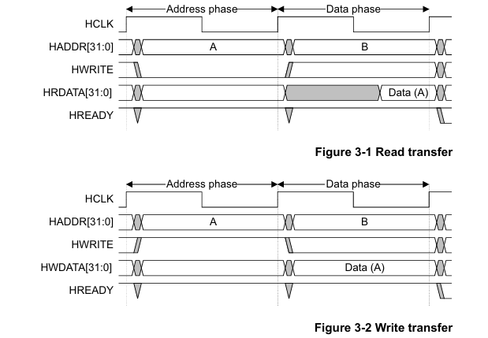
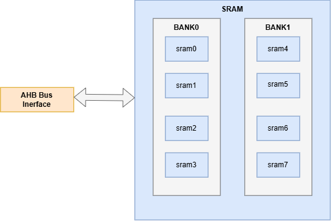
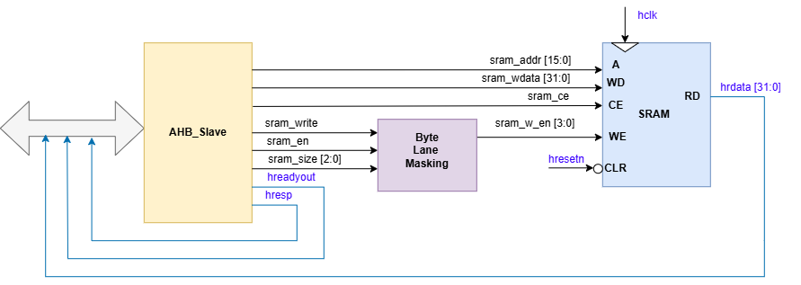
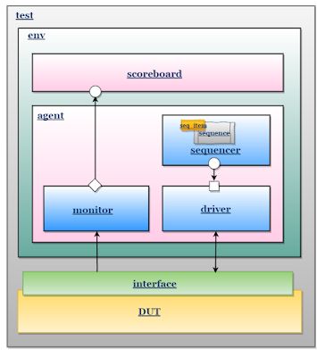
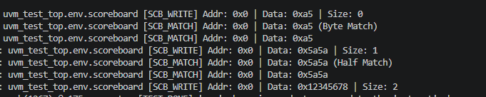
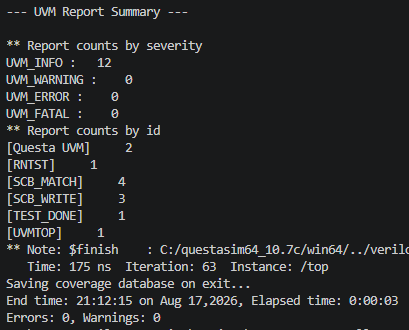
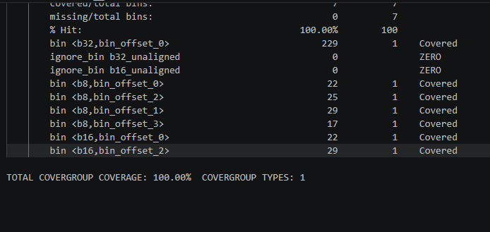

<!-- ABOUT THE PROJECT -->
## About The Project

This repository presents the RTL design and comprehensive UVM-based verification environment for an Advanced High-performance Bus (AHB) SRAM Controller. Inspired by the research paper “Functional Verification of SRAM Controller based on UVM,” this IP serves as a robust bridge, facilitating seamless data operations between the AHB system bus and SRAM modules via a dedicated slave interface. Key architectural highlights include a dual-bank memory partitioning optimized for low-power consumption, alongside native support for flexible 8-bit, 16-bit, and 32-bit data transfers.

### Key Features

* **AMBA AHB Protocol Compliance:** Features an AHB slave interface for seamless communication with the system bus.
* **Dual-Bank Architecture:** Divided into two independent SRAM banks to optimize power consumption.
* **Multi-Size Transfers:**  Supports flexible read/write operations for 8-bit, 16-bit, and 32-bit data.
* **Standard UVM Environment:**  Built a complete UVM testbench hierarchy (Agent, Environment, Test).
* **Self-Checking Scoreboard:** Uses an internal reference memory model to automatically verify data accuracy.

* **Assertion-Based Verification:** Uses SystemVerilog Assertions (SVA) to monitor signals and catch protocol errors.

### AHB Protocol using in this project

Simple transfer with no wait states:

* The Manager drives the address and control signals onto the bus after the rising edge of HCLK.
* The Subordinate then samples the address and control information on the next rising edge of HCLK.

| Signal | Width | Description |
| :--- | :--- | :--- |
| `hsel` | 1 | Slave select. |
| `htrans` | 2 | Transfer type. |
| `hsize` | 3 | Transfer size. |
| `hready` | 1 | Bus ready indicator (Input). |
| `haddr` | 16 | System address bus. |
| `hwrdata` | 32 | Write data bus. |
| `hrdata` | 32 | Read data bus. |
| `hreadyout` | 1 | Transfer done indicator (Output). |
| `hresp` | 2 | Transfer response. |

In this design, the SRAM controller acts as an AHB slave. It connects the AHB bus to the SRAM memory and performs read/write operations according to the AHB protocol. Single transfer mode is implemented:

* hready is always high (no wait states)
* hresp is always OKAY
### Project Architecture
#### SRAM Organization
* **Capacity:** 64 KB total (divided into two 32 KB banks).
* **Architecture:** Four 8-bit blocks per bank.
* **Dynamic Access:**
 8-bit: Activates 1 block.
 16-bit: Activates 2 block.
 32-bit: Activates 4 block.
 * **Power Optimization:** Only active blocks draw full power, heavily reducing overall energy consumption.

 

##### 32KB memory of each bank, split into 4 SRAM blocks. Each SRAM block :
* 8KB total memory   
* Word size : 8 bit
* 8192 memory capacity (byte unit) 

#### DUT Architecture

#### Verification Environment

### Project Components

#### RTL Modules

* **[sram_ctrl.sv](rtl/sram_ctrl.sv)**: The top-level wrapper module that instantiates and interconnects the AHB interface, masking logic, and memory blocks to construct the complete AHB SRAM Controller.
* **[ahb_slave.sv](rtl/ahb_slave.sv)**: Implements the AHB slave protocol interface, managing bus transactions and generating the necessary control signals for the internal memory components.
* **[byte_lane_masking_control.sv](rtl/byte_lane_masking_control.sv)**: Generates the precise write-enable masks to activate specific 8-bit memory blocks based on the transfer size (8/16/32-bit) and address offset.
* **[sram.sv](rtl/sram.sv)**: he core dual-bank memory array block used for safely storing and retrieving data based on the processed AHB addresses and write/read controls.

#### UVM Testbench

* **[ahb_transaction.sv](uvm_env/agent/ahb_transaction.sv)**:Defines the transaction class for packet generation with constraints
* **[ahb_driver.sv](uvm_ev/agent/ahb_driver.sv)**: Drives packets to the DUT using the interface.
* **[ahb_monitor.sv](uvm_env/agent/ahb_monitor.sv)**:Monitors input and output packets, sending data to the scoreboard.
* **[ahb_sequencer.sv](uvm_env/agent/ahb_sequencer.sv)**:Manages sequence item generation.
* **[ahb_agent.sv](uvm_env/agent/ahb_agent.sv)**:Integrates driver, monitor, and sequencer.
* **[ahb_scoreboard.sv](uvm_env/env/ahb_scoreboard.sv)**: Compares expected data against actual DUT outputs.
* **[ahb_environment.sv](uvm_env/env/ahb_environment.sv)**:Top-level environment connecting agent and scoreboard.
* **[ahb_sram_coverage.sv](uvm_env/env/ahb_sram_coverage.sv)**:Implements UVM covergroups to collect and measure functional coverage metrics for AHB transactions.
* **[ahb_if.sv](uvm_env/interface/ahb_if.sv)**:Defines the interface with clocking blocks and assertions for signal validation.
* **[ahb_sequences.sv](uvm_env/sequence/ahb_sequences.sv)**:Defines constrained-random and directed UVM sequences to generate diverse stimulus for the DUT.
* **[top.sv](tb/top.sv)**:Top-level testbench connecting the DUT and UVM environment.
### Verification Plan

| Test Name | Description |
| :--- | :--- |
| `base_test` | Sets up the basic UVM environment. |
| `addr0_test` | Tests 32-bit read and write operations at different addresses. |
| `addr1_test` | Runs random 32-bit read and write transfers. |
| `all_byte_offsets_test` | Tests 8-bit access at different byte positions (offsets 0, 1, 2, 3). |
| `all_sizes_test` | Tests all data sizes: 8-bit, 16-bit, and 32-bit. |
| `back_to_back_test` | Sends continuous data without stopping to test system speed. |
| `bank_boundary_test` | Tests reading and writing at the edges of the memory banks. |
| `hsize_test` | Checks if the controller handles valid data sizes correctly. |
| `low_power_test` | Checks if unused memory blocks are turned off to save power. |
| `reset_write_test` | Tries to write data while the system is resetting to ensure it is ignored. |
| `stress_random_test` | Runs a massive number of random tests to find hidden bugs. |
| `walking_data_test` | Tests the data lines using "walking 1s" and "0s" patterns. |

### Achievements

#### Scoreboard Summary Report

#### UVM Report

#### Functional Coverage Result
